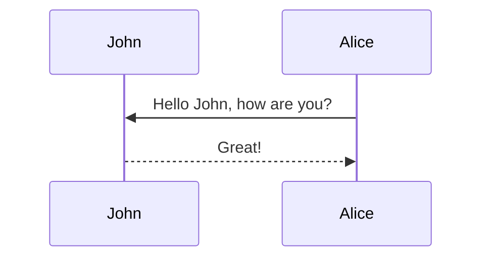

## Introduction

Despite the existence of a plethora of architectures and learning objectives, most language models in the current pantheon follow a time-tested recipe:  a Transformer backbone trained using a next-token prediction objective, with model outputs generated autoregressively. This recipe, while simple, has proved surprisingly resilient and is still the predominant paradigm for training language models. 

A quick recap, the autoregressive models factorize the joint probability of a token sequence of length $$T$$, where $$x_{1:T}$$ is a product of next-step conditionals:

$$
p(x_{1:T}) = \prod_{t=1}^{T} p(x_t \mid x_{\< t})
$$

$$
x_{\< t} = (x_1, x_2, \ldots, x_{t-1})
$$

Here, $$p(x_{1:T})$$ denotes the joint probability of the entire sequence and $$\(p(x_t \mid x_{\< t})\)$$ represents the probability of the next token given all previous tokens, and $$\(x_{\< t}\)$$ refers to the prefix of the sequence up to time step $$t-1$$. This decomposition expresses a high-dimensional distribution as a product of simpler conditional distributions, which is the defining property of autoregressive models.

These models generate sequences one token at a time. This formulation comes with some inherent disadvantages:
1. Generating tokens one at a time imposes a sequential bottleneck. This means that generation latency scales with output length. While methods like KV caching make subsequent decoding faster, they are not able to eliminate the sequential dependency.
2. Errors can rapidly accumulate and snowball, as the generation of one incorrect token causes it to be added as context for all subsequent tokens to rely on.
3. Once a token is generated, there is no possibility for editing or revision in-place; the generated token remains part of the context for the rest of the sequence.
4. ARMs optimize for token-level likelihood, which does not always correlate with sequence-level goals. The resulting tunnel vision can impede the ability of the model to plan over long-horizons or maintain coherence over longer outputs
5. Hallucinations get exacerbated with ARMs, because once a token is generated, it is used as context for subsequent generations, therefore leading the model to generate coherent narratives over incorrect facts.
6. Theoretically, certain distributions can be represented more efficiently by models that marginalize over latent variables; representing the same distributions via a purely autoregressive formulation can require scaling up the model parameter size super-polynomially with input length. 

As the bitter lesson shows, working towards learning more general capabilities and scaling them has proven more fruitful than injecting tasks or domain-specific rules into a model. In a similar vein, we can challenge the inductive biases of autoregressive models (i.e. that language sequences are generated left-to-right), thus providing the model with more freedom. 

One such alternative to autoregressive models is the diffusion paradigm. Diffusion models have seen great success in computer vision, but just like many other techniques that have found success in computer vision, adapting them to text has been hard, primarily due to the discrete nature of language. Therefore, more focus has been placed on discrete diffusion models.

In this blog, we focus specifically on masked discrete diffusion models, termed as dLLMs. Masked diffusion models have garnered a lot of interest recently, with a rapidly growing body of work in this paradigm.

Masked diffusion works by:
1. Defining a forward noising process that gradually replaces tokens with a special token (typically \[MASK]), and
2. Learning a reverse denoising process that iteratively predicts and “locks in” tokens until the sequence is fully unmasked.

The masked diffusion learning objective looks similar to masked language modeling (e.g. BERT), or denoising autoencoding (e.g. BART). However, there is a key difference differentiating diffusion from these other objectives. 	Diffusion models are trained across a range of corruption levels and use an iterative sampling process that starts from a fully or almost fully noisy sequence and progressively denoises, rather than doing a single reconstruction from a fixed corruption scheme like BERT or BART.

Diffusion models are still generative models. Unlike masked language modeling where the masking rate is fixed through the training process, diffusion models randomly sample a masking rate (or “time”) between 0 and 1 for each example. 

A typical masked diffusion training objective can be expressed as a time-weighted cross entropy calculated over masked tokens:

$$
t \sim \mathcal{U}(0,1), \qquad x_t \sim q(x_t \mid x_0, t)
$$

$$
\mathcal{L}(\theta)
= \mathbb{E}_{x_0,\, t,\, x_t}
\Big[
    w(t)\,
    \sum_{i \in \mathcal{M}(x_t)}
        -\log p_\theta(x_{0,i} \mid x_t, t)
\Big]
$$

In this formulation, we first sample a time variable 

$$
t \sim \mathcal{U}(0,1)
$$ 

representing a point along a continuous noising schedule. Given the original data $$x_0$$, we then generate a partially corrupted version 

$$
x_t \sim q(x_t \mid x_0, t)
$$ 

where the corruption is controlled by the sampled time $$t$$.  

The model is trained to reverse this corruption using the loss function:

$$
\mathcal{L}(\theta)
= \mathbb{E}_{x_0, t, x_t} \Big[
    w(t) \sum_{i \in \mathcal{M}(x_t)}
        -\log p_\theta(x_{0,i} \mid x_t, t)
\Big]
$$

Here, $${M}(x_t)$$ indicates the positions in $$x_t$$ that have been masked or noised, and $$w(t)$$ is a weighting term that ensures heavily corrupted examples do not dominate the learning signal.  

Intuitively, the loss encourages the model to predict the original tokens $$x_{0,i}$$ at the masked positions, given the noisy input $$x_t$$ and the noise level $$t$$. By learning to undo the corruption at every point along the noise schedule, the model effectively learns a **denoising process** that can reconstruct clean data from partially corrupted inputs. This principle is central to diffusion-based generative modeling and related reconstruction tasks.

Autoregressive models optimize the maximum likelihood objective directly. Diffusion models are derived from a variational formulation (ELBO / NELBO), though many practical implementations use a weighted mixture of masked-token cross-entropies as shown above.

## Characteristics of Diffusion Models

From a user standpoint, diffusion models are said to generate by infilling (iterative refinement of a partially completed sequence). This is especially suitable for tasks like coding or reasoning, which are often non-linear. Infilling also provides opportunities for personalization and enhances structured generation. The decoding order is also configurable. 

Some obvious benefits of diffusion models include the ability to perform any-order modeling, in-place context modification, and parallel token prediction. 

Let’s now explore the mechanics of masked diffusion in detail.

### Masked Diffusion Explained

Masked diffusion can be implemented independent of the architecture. For example, masked diffusion can use state-space models as the backbone. 

#### Forward Process

Consider an example sequence x in the training dataset:

`‘He invented the parallelogram as a means to exact vengeance upon his detractors’`

A number $$t$$ sampled randomly between 0 and 1 (often chosen from a discrete mask schedule in practice), is chosen to be the mask strength. Each token in the given sequence is replaced by a [MASK] token with probability $$t$$. 

For example, if $$t=0.2$$, 

`‘He invented the [MASK] as a means to [MASK] vengeance upon [MASK] detractors’`

If $$t=0.8$$, 

`‘[MASK] invented [MASK] [MASK] [MASK] means [MASK] exact vengeance [MASK] [MASK] [MASK]`

Let’s refer to the masked sequence as $$xt$$.

The objective of the model is to predict the masked tokens in $$xt$$. The training loss is typically the cross entropy over the masked tokens, with a normalization/weighting such that examples with higher masking rates do not contribute disproportionately to the training signal. One common way of normalization is to divide the loss by the masking strength $$t$$. Equivalently, some implementations instead normalize by the number of masked tokens.

The key difference between masked language models like BERT and diffusion models is that in BERT the corruption policy (masking rate) is fixed throughout training, while in masked diffusion models the masking rate $$t$$ varies per example across a range of masking rates.

#### Reverse Process

`Prompt: ‘Is Socotra a real place?’`
`Response:  ‘Yes, Socotra is an island in Yemen.’`

A typical reverse process proceeds like this:

For a given prompt $$p$$, an initial answer is generated consisting entirely of \[MASK] tokens. The response length is typically a hyperparameter. 

The reverse process (called denoising) runs for K steps, which is typically a hyperparameter.

At each step, the model predicts tokens for all the \[MASK] positions at once, conditioned on the prompt and the currently unmasked tokens. It then commits some tokens (unmasks them) and remasks a portion of tokens (often low-confidence ones), either randomly or via heuristics.
Generation stops after all denoising steps are completed. If an \<EOS> token is present in the final output, then the tokens after it are discarded.

In practice, there is a discrepancy between training and inference; during inference, the whole output often starts off as masked and is gradually de-masked. 

### Training

Diffusion language models can continue using the same Transformer backbones that underpin today’s language models. The primary change is in the learning objective, where instead of predicting the next token in a sequence as autoregressive models do, diffusion models are taught to predict all the masked tokens in a sequence simultaneously. This also means that dLLMs can be built using non-Transformer backbones (e.g., state-space models), as long as the architecture supports conditioning on a partially observed sequence.

#### Typical Training Pipeline
1. Pre-train from scratch OR Continued pre-training
2. Midtraining/annealing
3. Instruction tuning
4. Reinforcement learning

Note that dLLMs can either be trained from scratch or can be adapted from a base ARM. 

#### Pre-training From Scratch

While training from scratch, training with next-token prediction objective is more sample and compute efficient than diffusion in practice. This is because in dLLMs, the loss is typically calculated only over the masked tokens, so each forward pass in dLLMs supervises fewer target positions than an AR pass . As a result, given the same architecture, compute, and data, AR baselines typically train faster and reach higher quality, though the exact gap depends on masking schedules, weighting, and decoding strategies used. 

#### Adapting AR Models to dLLMs

Pre-training from scratch is not the only option; one can also adapt existing autoregressive models to support diffusion. The adaptation is typically carried out using continual pre-training. In this technique, we take a stable checkpoint of an autoregressive LLM, replace the causal mask with a bidirectional mask and then continue pre-training it with the diffusion learning objective. 

Chandrasegaran et al. propose that self-attention weights are trained with a relatively higher learning rate to help adapt the model to the diffusion paradigm. The feed forward layers are trained at a relatively lower learning rate so that world knowledge and other capabilities learned during the AR pre-training stage are retained. This helps mitigate catastrophic forgetting. They also observe that dLLMs benefit from larger batch sizes during continual pre-training. 
Other techniques for adaptation from ARMs include 

* Grafting, where the architecture is edited by swapping causal attention blocks for bidirectional attention blocks.
* Attention mask annealing, where the causal mask is gradually converted into a bidirectional one during training.

Masked language models like BERT can also be converted into diffusion models using the continued pre-training approach.

### Inference

During inference, the model starts from a masked output sequence and generates tokens through a series of denoising steps. Within a denoising step, the masked positions are typically predicted in parallel, followed by an accept or remask decision.

A basic denoise-and-remask procedure works as follows. We first initialize the output sequence to be entirely masked:

$$
y^{(0)} = [\text{MASK}]^L
$$

where $$L$$ is the sequence length, typically chosen as a hyperparameter. Then, for a fixed number of iterations $$k = 1, \dots, K$$, we perform the following steps:

1. **Predict masked token distributions:** Using the model, we estimate the probability distribution over tokens at the currently masked positions:

$$
p_\theta(\cdot \mid p, y^{(k-1)}, k),
$$

where $$p$$ may represent any conditioning information (e.g., a prompt or context), $$y^{(k-1)}$$ is the sequence from the previous iteration, and $$k$$ indicates the current step.

2. **Commit a subset of positions:** We select a subset of tokens to “commit” to the output sequence. This is usually based on a confidence criterion, such as selecting the highest-probability tokens or those with the lowest entropy.

3. **Optional remasking:** To refine the sequence, a heuristic or schedule may remask a subset of previously committed tokens that are considered low-confidence. This allows the model to revisit uncertain predictions in subsequent iterations.

4. **Update the sequence:** The newly committed tokens replace the previous masked positions to form the updated sequence $$y^{(k)}$$.

After completing all $$K$$ iterations, the final sequence $$y^{(K)}$$ is returned. If an end-of-sequence token \<EOS> appears, any tokens following it are discarded.  

This iterative denoising procedure gradually replaces masks with high-confidence predictions, while optionally revisiting uncertain tokens. Over multiple steps, the sequence converges toward a coherent output that reflects both the learned model distribution and any conditioning context.

The initial output sequence can be fully masked or it can contain parts of the output we already know; delegating the model to perform infilling for the tokens we do not know. This can be operationalized in a few ways, such as constrained endings or structured infilling. 

#### Structured Infilling

Instead of asking the model to generate output in a specific structured format (like JSON), we use a structured format template and let the dLLM fill in the blanks.

For a given structured format, we have:
* Invariant tokens (syntax, labels, brackets etc), which stay unmasked
* Variable tokens (value, content) which are masked

An advantage with infilling templates is that it shrinks the search space during the generation, now that it need only choose content tokens and not tokens related to the syntax. Another advantage is that it implicitly ensures the structured format is adhered to during generation.

The tricky part of this technique is in deciding how many masked tokens to allocate for the variables. If the masked tokens added are inadequate, the output has to be truncated. If too many masked tokens are added, then the model tries to fill in the extraneous masked tokens with content, leading to unpredictable outcomes. 

Self-adaptive schema scaffolding (S3) addresses this issue by allowing the model to output a special null token upon which generation for that variable block stops, leaving the remaining slots empty.

### Decoding Strategies

#### Random

A simple baseline is random unmasking, where the positions to commit/unmask at each step are chosen uniformly at random. However in practice, heuristics tend to be more efficient and higher quality.

#### Confidence-Based Sampling

Confidence-based sampling is a common strategy in iterative denoising or masked sequence generation. In this approach, tokens with high confidence are “locked in,” while low-confidence tokens may be remasked for further refinement.  

However, this strategy is not always optimal. High-confidence tokens are often syntactic or structurally predictable, which can cause the model to commit to the surface structure of the sequence too early, potentially limiting the flexibility of subsequent generation.  

A typical way to quantify the confidence of a token at position \(i\) is:

$$
c_i = \max_v p_\theta(v \mid \text{context})
$$

where $$p_\theta(v \mid \text{context})$$ is the predicted probability of token $$v$$ given the current context, and $$c_i$$ represents the confidence score for position $$i$$. Tokens with higher $$c_i$$ are more likely to be committed, while those with lower confidence can be remasked and reconsidered in future iterations.  

This method provides a simple and interpretable heuristic for guiding which positions to finalize versus which to refine, balancing stability and flexibility in the generated sequence.

#### Entropy-Based Sampling

This technique uses entropy as a confidence measure, where lower entropy implies higher confidence. This is often more robust than raw probability thresholds. A common way to calculate the entropy at position $$i$$ is:

$$
H_i = - \sum_v p_i(v) \log p_i(v)
$$

where $$p_i(v)$$ is the probability assigned to token $$v$$ at position $$i$$. Here, $$H_i$$ measures the uncertainty of the model’s prediction: positions with low entropy correspond to confident predictions, while positions with high entropy indicate ambiguity.  

#### Margin-Based Sampling

Margin-based sampling uses a second-order confidence measure: we take the difference between the confidence of the most probable token and the second most probable token as the margin, and select only tokens that have a high enough margin.

Formally, let $$v_1$$ and $$v_2$$ be the most probable and second-most probable tokens at position $$i$$. The margin is defined as:

$$
m_i = p_i(v_1) - p_i(v_2)
$$

where $$p_i(v_1)$$ and $$p_i(v_2)$$ are the probabilities assigned to these tokens.  

A higher margin $$m_i$$ indicates that the model is strongly favoring the top token over the runner-up, while a small margin suggests uncertainty. During iterative generation, margin-based sampling allows the model to commit tokens with high certainty while deferring those with ambiguous predictions for further refinement.

#### EB Sampler

Entropy-bounded (EB) sampling typically commits tokens until an entropy budget/constraint is met (e.g. keep committing the lowest-entropy positions until the remaining masked positions have entropy above a target, or until a step-wise budget is exhausted). 

#### PC Sampler

Position-calibrated (PC) samplers add a position-aware calibration term to avoid pathological early commitments to “easy” regions (e.g. always unmasking near the prefix first). Without calibration, models may tend to unmask or commit tokens near the beginning of a sequence first, which can reduce diversity and flexibility in later steps. 

One way to implement this is to adjust the confidence score of each position with a position-dependent bias:

$$
\tilde{s}_i = s_i + b(i),
$$

where $$s_i$$ is a base confidence score—such as the negative entropy $$-H_i$$ or the raw probability $$c_i$$ and $$b(i)$$ is a bias or penalty term that depends on the position $$i$$.  

By adding $$b(i)$$, positions that are typically “easy” to commit (like the prefix) can be down-weighted, encouraging the sampler to consider less obvious positions first. The calibrated score $$\tilde{s}_i$$ is then used to select which positions to commit or remask in the current iteration, promoting a more balanced and robust sequence generation process.

### Unmasking/Remasking Strategies

#### Static Low-Confidence Remasking

In this masking regime, the denoising occurs over K steps. At each step, a fixed number of tokens N/K, where N is the size of the output, are unmasked, usually chosen by a confidence criterion. The low-confidence tokens are remasked.

#### Dynamic Low-Confidence Remasking

A confidence threshold t is set. At a given denoising step, each token is unmasked only if it crosses the threshold t. If too few positions cross the threshold, then a minimum number of highest confidence tokens are unmasked.

#### Dilute Unmasking Schedule

Instead of committing aggressively every step, the schedule “dilates” commits, by committing fewer tokens early, more in the middle, and fewer near the end,  so that more global context can settle before locking in too many tokens.

### Speculative Decoding

Speculative decoding in diffusion models is more challenging than in autoregressive models because generation can happen in parallel, and some models use block-based decoding. Gao et al. propose **Self-Speculative Decoding (SSD)** to address these challenges. SSD consists of two main phases: self-drafting and verification.  

#### Self-Drafting
In this step, we construct a partial sequence that includes the prompt tokens, the tokens already committed in previous steps, and the currently masked positions. We then perform a single denoising step on this sequence to produce predictions for all masked tokens. This initial prediction step is referred to as self-drafting.  

If the model uses block-based decoding, the self-drafting procedure is applied within the current block as follows:  

- Sort the positions in the block by a confidence measure.  
- Select the top-$$k$$ positions as candidates for verification.  
- If there are fewer than $$k$$ positions in the block, extend the selection into subsequent blocks until $$k$$ positions are chosen.  

#### Verification
The $$k$$ drafted tokens are then verified using a **verification tree**, which efficiently checks multiple token proposals at once. Tokens that pass verification are committed to the sequence, while tokens that fail are remasked and will be reconsidered in later iterations.  

This two-phase procedure allows speculative decoding to leverage parallel generation while maintaining reliability, committing only those tokens for which the model demonstrates sufficient confidence.

## Equations

This theme supports rendering beautiful math in inline and display modes using [MathJax 3](https://www.mathjax.org/) engine.
You just need to surround your math expression with `$$`, like `$$ E = mc^2 $$`.
If you leave it inside a paragraph, it will produce an inline expression, just like $$ E = mc^2 $$.

To use display mode, again surround your expression with `$$` and place it as a separate paragraph.
Here is an example:

$$
\left( \sum_{k=1}^n a_k b_k \right)^2 \leq \left( \sum_{k=1}^n a_k^2 \right) \left( \sum_{k=1}^n b_k^2 \right)
$$

Note that MathJax 3 is [a major re-write of MathJax](https://docs.mathjax.org/en/latest/upgrading/whats-new-3.0.html)
that brought a significant improvement to the loading and rendering speed, which is now
[on par with KaTeX](http://www.intmath.com/cg5/katex-mathjax-comparison.php).

## Images and Figures

Its generally a better idea to avoid linking to images hosted elsewhere - links can break and you
might face losing important information in your blog post.
To include images in your submission in this way, you must do something like the following:

```markdown

```

which results in the following image:



To ensure that there are no namespace conflicts, you must save your asset to your unique directory
`/assets/img/2025-04-27-[SUBMISSION NAME]` within your submission.

Please avoid using the direct markdown method of embedding images; they may not be properly resized.
Some more complex ways to load images (note the different styles of the shapes/shadows):

<div class="row mt-3">
    <div class="col-sm mt-3 mt-md-0">
        
    </div>
    <div class="col-sm mt-3 mt-md-0">
        
    </div>
</div>
<div class="caption">
    A simple, elegant caption looks good between image rows, after each row, or doesn't have to be there at all.
</div>

<div class="row mt-3">
    <div class="col-sm mt-3 mt-md-0">
        
    </div>
    <div class="col-sm mt-3 mt-md-0">
        
    </div>
</div>

<div class="row mt-3">
    <div class="col-sm mt-3 mt-md-0">
        
    </div>
    <div class="col-sm mt-3 mt-md-0">
        
    </div>
    <div class="col-sm mt-3 mt-md-0">
        
    </div>
</div>

### Interactive Figures

Here's how you could embed interactive figures that have been exported as HTML files.
Note that we will be using plotly for this demo, but anything built off of HTML should work
(**no extra javascript is allowed!**).
All that's required is for you to export your figure into HTML format, and make sure that the file
exists in the `assets/html/[SUBMISSION NAME]/` directory in this repository's root directory.
To embed it into any page, simply insert the following code anywhere into your page.

```markdown

```

For example, the following code can be used to generate the figure underneath it.

```python
import pandas as pd
import plotly.express as px

df = pd.read_csv('https://raw.githubusercontent.com/plotly/datasets/master/earthquakes-23k.csv')

fig = px.density_mapbox(
    df, lat='Latitude', lon='Longitude', z='Magnitude', radius=10,
    center=dict(lat=0, lon=180), zoom=0, mapbox_style="stamen-terrain")
fig.show()

fig.write_html('./assets/html/2026-04-27-distill-example/plotly_demo_1.html')
```

And then include it with the following:

```html

<div class="l-page">
  <iframe
    src="{{ 'assets/html/2026-04-27-distill-example/plotly_demo_1.html' | relative_url }}"
    frameborder="0"
    scrolling="no"
    height="600px"
    width="100%"
  ></iframe>
</div>

```

Voila!

<div class="l-page">
  <iframe src="{{ 'assets/html/2026-04-27-distill-example/plotly_demo_1.html' | relative_url }}" frameborder='0' scrolling='no' height="600px" width="100%"></iframe>
</div>

## Citations

Citations are then used in the article body with the `<d-cite>` tag.
The key attribute is a reference to the id provided in the bibliography.
The key attribute can take multiple ids, separated by commas.

The citation is presented inline like this: <d-cite key="gregor2015draw"></d-cite> (a number that displays more information on hover).
If you have an appendix, a bibliography is automatically created and populated in it.

Distill chose a numerical inline citation style to improve readability of citation dense articles and because many of the benefits of longer citations are obviated by displaying more information on hover.
However, we consider it good style to mention author last names if you discuss something at length and it fits into the flow well — the authors are human and it’s nice for them to have the community associate them with their work.

---

## Footnotes

Just wrap the text you would like to show up in a footnote in a `<d-footnote>` tag.
The number of the footnote will be automatically generated.<d-footnote>This will become a hoverable footnote.</d-footnote>

---

## Code Blocks

This theme implements a built-in Jekyll feature, the use of Rouge, for syntax highlighting.
It supports more than 100 languages.
This example is in C++.
All you have to do is wrap your code in a liquid tag:


 <br/> code code code <br/> 


The keyword `linenos` triggers display of line numbers. You can try toggling it on or off yourself below:



int main(int argc, char const \*argv[])
{
string myString;

    cout << "input a string: ";
    getline(cin, myString);
    int length = myString.length();

    char charArray = new char * [length];

    charArray = myString;
    for(int i = 0; i < length; ++i){
        cout << charArray[i] << " ";
    }

    return 0;

}



---

## Diagrams

This theme supports generating various diagrams from a text description using [mermaid.js](https://mermaid-js.github.io/mermaid/){:target="\_blank"} directly.
Below, we generate examples of such diagrams using [mermaid](https://mermaid-js.github.io/mermaid/){:target="\_blank"} syntax.

**Note:** To enable mermaid diagrams, you need to add the following to your post's front matter:

```yaml
mermaid:
  enabled: true
  zoomable: true # optional, for zoomable diagrams
```

The diagram below was generated by the following code:


````

````


---

## Tweets

An example of displaying a tweet:


An example of pulling from a timeline:


For more details on using the plugin visit: [jekyll-twitter-plugin](https://github.com/rob-murray/jekyll-twitter-plugin)

---

## Blockquotes

<blockquote>
    We do not grow absolutely, chronologically. We grow sometimes in one dimension, and not in another, unevenly. We grow partially. We are relative. We are mature in one realm, childish in another.
    —Anais Nin
</blockquote>

---

## Layouts

The main text column is referred to as the body.
It is the assumed layout of any direct descendants of the `d-article` element.

<div class="fake-img l-body">
  <p>.l-body</p>
</div>

For images you want to display a little larger, try `.l-page`:

<div class="fake-img l-page">
  <p>.l-page</p>
</div>

All of these have an outset variant if you want to poke out from the body text a little bit.
For instance:

<div class="fake-img l-body-outset">
  <p>.l-body-outset</p>
</div>

<div class="fake-img l-page-outset">
  <p>.l-page-outset</p>
</div>

Occasionally you’ll want to use the full browser width.
For this, use `.l-screen`.
You can also inset the element a little from the edge of the browser by using the inset variant.

<div class="fake-img l-screen">
  <p>.l-screen</p>
</div>
<div class="fake-img l-screen-inset">
  <p>.l-screen-inset</p>
</div>

The final layout is for marginalia, asides, and footnotes.
It does not interrupt the normal flow of `.l-body`-sized text except on mobile screen sizes.

<div class="fake-img l-gutter">
  <p>.l-gutter</p>
</div>

---

## Other Typography?

Emphasis, aka italics, with _asterisks_ (`*asterisks*`) or _underscores_ (`_underscores_`).

Strong emphasis, aka bold, with **asterisks** or **underscores**.

Combined emphasis with **asterisks and _underscores_**.

Strikethrough uses two tildes. ~~Scratch this.~~

1. First ordered list item
2. Another item

- Unordered sub-list.

1. Actual numbers don't matter, just that it's a number
   1. Ordered sub-list
2. And another item.

   You can have properly indented paragraphs within list items. Notice the blank line above, and the leading spaces (at least one, but we'll use three here to also align the raw Markdown).

   To have a line break without a paragraph, you will need to use two trailing spaces.
   Note that this line is separate, but within the same paragraph.
   (This is contrary to the typical GFM line break behavior, where trailing spaces are not required.)

- Unordered lists can use asterisks

* Or minuses

- Or pluses

[I'm an inline-style link](https://www.google.com)

[I'm an inline-style link with title](https://www.google.com "Google's Homepage")

[I'm a reference-style link][Arbitrary case-insensitive reference text]

[I'm a relative reference to a repository file](../blob/master/LICENSE)

[You can use numbers for reference-style link definitions][1]

Or leave it empty and use the [link text itself].

URLs and URLs in angle brackets will automatically get turned into links.
http://www.example.com or <http://www.example.com> and sometimes
example.com (but not on Github, for example).

Some text to show that the reference links can follow later.

[arbitrary case-insensitive reference text]: https://www.mozilla.org
[1]: http://slashdot.org
[link text itself]: http://www.reddit.com

Here's our logo (hover to see the title text):

Inline-style:


Reference-style:
![alt text][logo]

[logo]: https://github.com/adam-p/markdown-here/raw/master/src/common/images/icon48.png "Logo Title Text 2"

Inline `code` has `back-ticks around` it.

```javascript
var s = "JavaScript syntax highlighting";
alert(s);
```

```python
s = "Python syntax highlighting"
print(s)
```

```
No language indicated, so no syntax highlighting.
But let's throw in a <b>tag</b>.
```

Colons can be used to align columns.

| Tables        |      Are      |  Cool |
| ------------- | :-----------: | ----: |
| col 3 is      | right-aligned | $1600 |
| col 2 is      |   centered    |   $12 |
| zebra stripes |   are neat    |    $1 |

There must be at least 3 dashes separating each header cell.
The outer pipes (|) are optional, and you don't need to make the
raw Markdown line up prettily. You can also use inline Markdown.

| Markdown | Less      | Pretty     |
| -------- | --------- | ---------- |
| _Still_  | `renders` | **nicely** |
| 1        | 2         | 3          |

> Blockquotes are very handy in email to emulate reply text.
> This line is part of the same quote.

Quote break.

> This is a very long line that will still be quoted properly when it wraps. Oh boy let's keep writing to make sure this is long enough to actually wrap for everyone. Oh, you can _put_ **Markdown** into a blockquote.

Here's a line for us to start with.

This line is separated from the one above by two newlines, so it will be a _separate paragraph_.

This line is also a separate paragraph, but...
This line is only separated by a single newline, so it's a separate line in the _same paragraph_.
